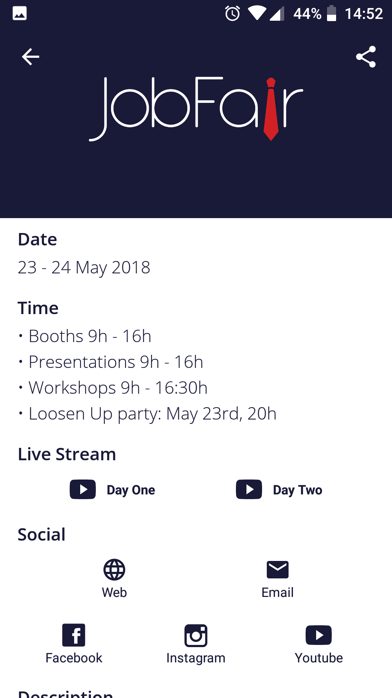
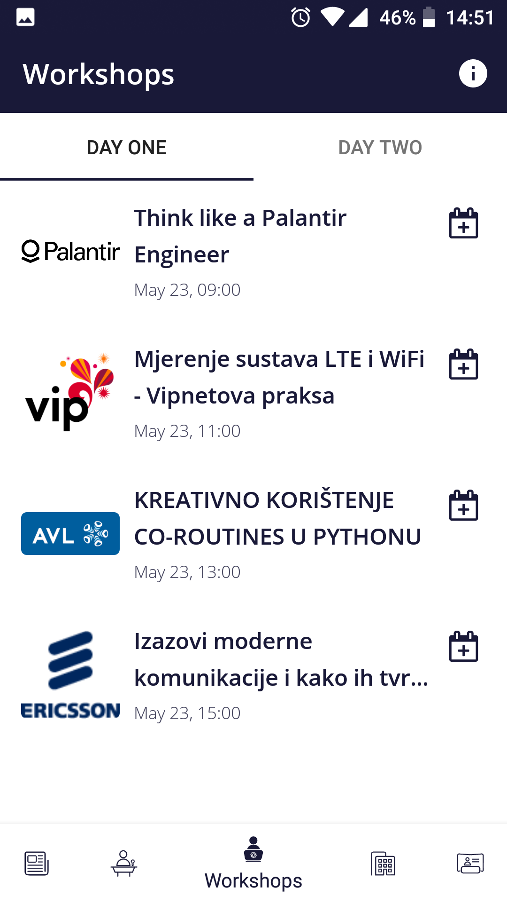
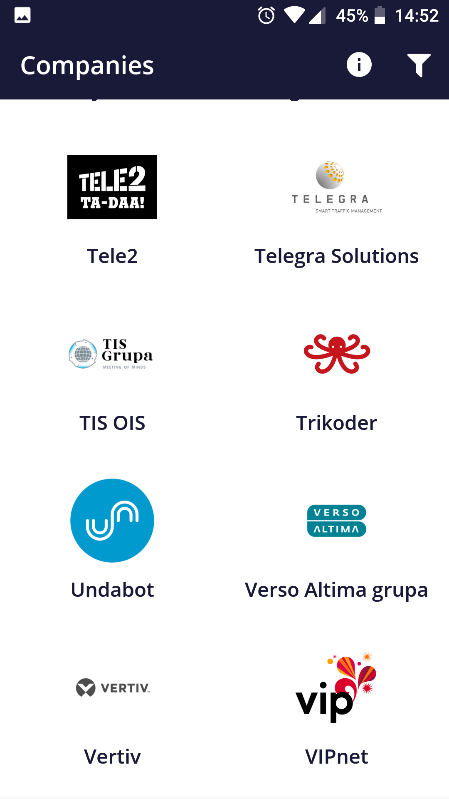
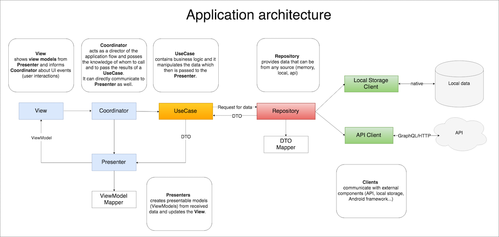

# JobFair

[Job Fair](https://jobfair.fer.unizg.hr/) is the biggest career fair in Croatia which includes over 100 companies and is visited by over 3,000 students. The fair is held in the halls of the Faculty of Electrical Engineering and Computing in Zagreb. The goal is to offer students the chance to see what job and career opportunities there are in Croatia, as well as abroad, and to connect employers with the best students of the University of Zagreb. 

# Application

JobFair application provides all information for the [event]((https://jobfair.fer.unizg.hr/)). 

## Screens

- News list and details
- Presentations list per days and presentation details
- Workshops list per days and workshop details
- Companies list with industry filter and company details
- Booths location map
- Info

  
   
   
   
   
  

## Architecture
This project is written in clean architecture and it's covered with unit tests.

Following diagram briefly shows architecture used in the application:

## Used libraries

List of the some main libraries used in the application:

- [Dagger](https://github.com/google/dagger) - used for the Dependency Injection
- [Apollo](https://github.com/apollographql/apollo-android) - used as a client for the GraphQL API
- [Retrofit](https://github.com/square/retrofit) - used as a client for the fetching RSS Feeds
- [Glide](https://github.com/bumptech/glide) - used for the image loading and caching
- [ReactiveX](https://github.com/ReactiveX) - RxJava, RxAndroid, RxKotlin used for Async Programming

## Project setup

Some files or secrets should not be public. 

Below is the list of those files or values and instructions for the setup.

### Google Maps

- Add your Google Maps API key to proper file `api_keys.xml` in resource `values` package.
- There is a different file for the `debug` and `release` build.

### Firebase

- Add `google-services.json` file to `app` package (it's added in `.gitignore`).

### Release application signing

- Add release keystore to `secrets` directory and provide release `signingConfiguration` in app `build.gradle` file

# Developed by Undabot

## About Undabot

We are coders, makers, thinkers, and creators of **#mobilemoments**. Would you like to join us? Check out the open positions at our [Careers](https://undabot.com/careers/) page!